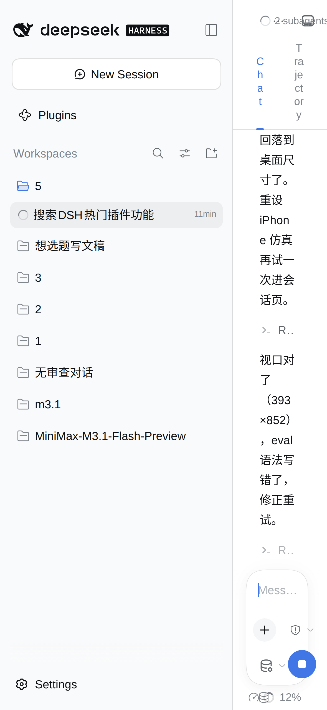
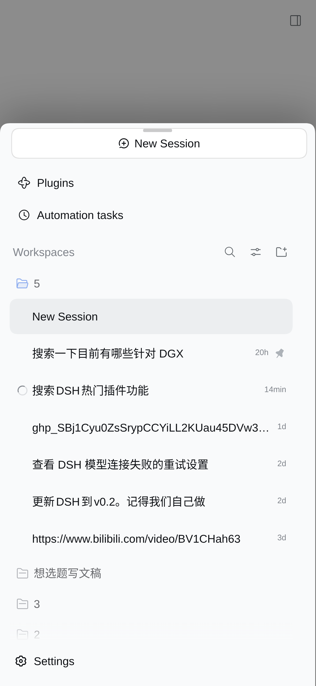

# dsh-kimi-shell

**DSH（DeepSeek Harness）手机端 Web 的独立移动壳：会话侧栏变 kimi 风格底部浮层，开箱即用、单插件安装。**
**A standalone mobile shell for DSH web: turns the session sidebar into a kimi-style bottom sheet. One plugin, zero extra deps.**

[中文](#中文) · [English](#english)

| 改造前 Before | 改造后 After |
|---|---|
| 窄屏下侧栏挤占内容、无移动交互 | 底部上滑浮层 + FAB，会话记录全程可见 |
|  |  |

## 中文

DSH 的 Web 界面按桌面设计，手机上侧栏挤占内容、交互别扭。本插件提供一个完整的移动壳：

- **底部浮层**：100vw × 82dvh、顶部圆角 + 抓手 + 投影 + 遮罩；开合为瞬时翻转（display 语义，
  规避宿主模态冻结机制把动画钉在半途的坑）
- **FAB + 遮罩**：收起态右下角悬浮球为唯一入口（系统色自适应明暗）；点遮罩 / 选中会话后自动收起
- **内容 kimi 化**：会话列表铺满整宽、44px 触屏行、工作区分组降为紧凑小节头、隐藏品牌行
- **项目行 + 常显**（v0.5.0）：宿主「新建会话」+ 按钮靠 :hover 展开，手机无 hover 永不可见；
  现在文件夹行尾常显 34px 大按钮，点按即在该文件夹新建会话（同容器的 ⋯ 菜单含删除工作区等
  危险项，保持隐藏；会话行的归档/置顶按钮同样不动，防误触）
- **重命名防误触**（v0.5.0）：宿主把「双击标题」绑成重命名，手机快速两连点就误弹；
  现在真双击一律拦掉，改为**长按会话行 500ms**（短震动反馈）唤起原生重命名弹窗，
  松手不再顺带切换会话
- **设置弹窗手机化**（v0.4.0）：桌面双栏小窗 → 近全屏单列，分类栏变顶部横滑药丸标签条，
  内容全宽纵滚，主题三选横排等分；作用域锚定 `:has(> nav)`，宿主其余小弹窗（重命名/删除确认）
  保持原生样式，且统一提到浮层之上不被遮挡
- **输入法防误弹**：切换/新建会话后不再自动聚焦输入框（键盘不遮挡会话记录）；直接点输入框正常打字
- **默认浅色主题**：手机端首次加载时若主题偏好仍是 system（跟随系统），一次性改写为 light
  并持久化到宿主 user-settings（服务端保存，之后所有设备默认浅色；显式选过 dark 的不动）
- **viewport 补齐**：`viewport-fit=cover`（刘海安全区）、`interactive-widget=resizes-content`（键盘让位）、
  禁双击缩放、输入区 16px 防 iOS 聚焦放大
- **桌面零影响**：全部锁在 `(max-width: 1023px) and (pointer: coarse)`，鼠标指针任何窗口宽度不生效；
  不写宿主半逻辑、不 patch 组件、自有 `data-kimi-*` 命名空间
- **与 dsh-web-mobile 互斥**：检测到其在场时本插件自动休眠（console 提示），卸载后者后自动接管

### 环境要求

- DeepSeek Harness `dsh` ≥ 0.2.0-rc.1（在 0.2.0-rc.1 实测；帧探测钩子在 0.1.7-rc.2 亦可用）
- **无任何插件依赖**（v0.2 及更早版本依赖 dsh-web-mobile，v0.3 起独立）

### 安装 / 卸载

```sh
dsh plugin --profile web add github:Bill-666code/dsh-kimi-shell   # 热生效，无需重启服务
dsh plugin --profile web rm dsh-kimi-shell                        # 卸载
```

装好后手机浏览器打开 DSH Web 即生效；桌面端不受影响。

### 工作原理

1. **外壳 reconciler**：`[data-shell-overlay]` 的父元素定位宿主帧并标记 `data-kimi-frame`
   （MutationObserver + rAF 合帧，宿主重渲染自愈）；确保 FAB / 遮罩元素存在。
2. **CSS**：媒体查询门控 + 自有命名空间，侧栏列 → 底部浮层盒子，网格收为单列；
   开合状态直接由宿主原生 `data-sidebar-collapsed` 属性驱动（收起 = display:none，
   不可动画也不可被宿主模态冻结机制钉住）；300ms 巡检强制内联兜底。
3. **开合 API**：官方 `ctx.layout.toggleSidebar()`（0.2.0 起需显式 `inject: ['layout','theme']` 声明）。
4. **主题**：官方 `ctx.theme.setTheme('light')`，仅当偏好为 system 时一次性写入。

### 无触摸仿真的浏览器上如何调试

浏览器原生 CSS media query 不吃 JS 补丁，无头/桌面浏览器看不到移动效果。测试通道：
`sessionStorage.setItem('kimi-test','1')` 后刷新（URL query 会被宿主清掉，hash 也可能被清，
sessionStorage 最可靠）——CSS 去 media 包装直接生效，JS 外壳效果强制启用。`?kimi-test=0` 退出。
注意：主题改写在 TEST 下不触发（避免污染测试者的服务端偏好）。

### 兼容性说明

- 会话树定位用 `[class*="sessionRow"]` 等子串选择器（CSS module 哈希防漂移技术，社区通用做法），
  宿主大版本升级改类名时可能需要跟随更新；
- 已实测：dsh 0.2.0-rc.1 + dsh-better-sidebar 0.24.1 共存；
  与 dsh-web-mobile 同时安装时本插件自动休眠。

## English

A standalone mobile shell for [DSH](https://github.com/deepseek-ai/deepseek-harness) web:

- Session sidebar → **kimi-style bottom sheet** (100vw × 82dvh, rounded top, grabber, scrim)
- Instant open/close (display semantics — immune to the host's modal-freeze pinning transitions)
- FAB (system-color adaptive) + backdrop; sheet auto-dismisses after picking a session
- Always-visible **"+" new-session button on folder rows** (v0.5.0) — host reveals it on :hover only,
  which never happens on touch; 34px hit target, dangerous ⋯ menu stays hidden
- **Accidental rename guard** (v0.5.0): host binds double-click-on-title to rename, which mobile
  taps trigger by mistake — real dblclicks are now swallowed; **long-press a row 500ms** (haptic tick)
  to open the native rename dialog instead, without switching sessions on release
- **Mobile settings dialog** (v0.4.0): desktop two-pane → near-fullscreen single column with a
  horizontally scrollable pill tab strip; scoped via `:has(> nav)` so other host modals stay native
- No keyboard hijack on session switch; light theme default (persisted once, only when preference is "system")
- viewport hardening (cover / interactive-widget / no double-tap zoom / 16px inputs)
- Zero desktop impact — everything gated behind `(max-width: 1023px) and (pointer: coarse)`
- Dorms when dsh-web-mobile is present (avoid double shells)

### Requirements

- dsh ≥ 0.2.0-rc.1 · no other plugins needed

### Install

```sh
dsh plugin --profile web add github:Bill-666code/dsh-kimi-shell
```

Hot-reloads into a running profile — no service restart. Desktop untouched.

## License

MIT
